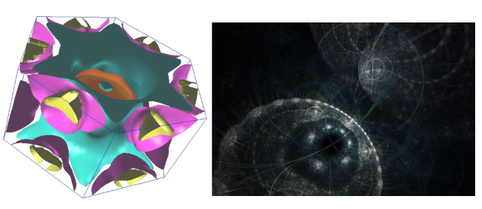
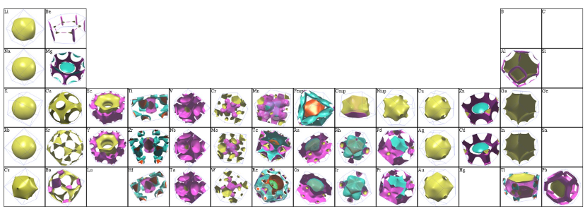
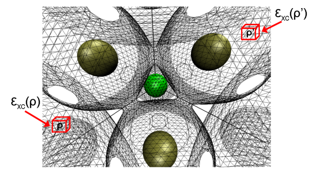
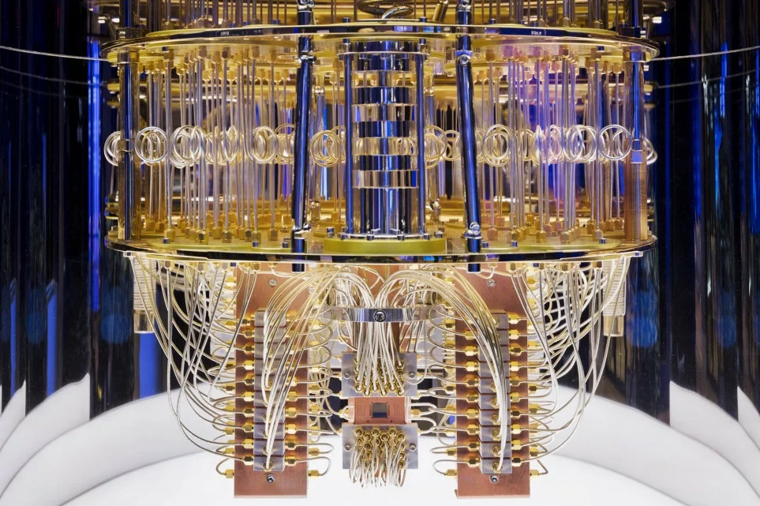

# Quantum-Simulation-of-Many-Body-Systems-with-Python
Python tools for quantum chemistry, electronic structure, density functional theory, quantum simulation

## Introduction

Quantum simulation of many-body systems is a rapidly evolving field at the intersection of quantum physics, quantum chemistry, and 
computational science. It seeks to understand and predict the properties and behaviors of complex systems with 
multiple interacting particles, such as electrons in a solid or atoms in a molecule. 
This task is notoriously challenging due to the immense computational resources required to 
accurately model interactions in these systems.

The development of Density Functional Theory (DFT) in the 1960s marked a 
significant milestone in this journey. Pioneered by physicists like Walter Kohn and Pierre Hohenberg, 
DFT provided a more efficient way to calculate the electronic structure of many-body systems. 
It approximates the complex many-body problem by treating the electron density as the central 
quantity instead of the many-electron wavefunction. This simplification made it possible to 
compute properties of larger systems than was feasible with previous wavefunction-based methods.

However, DFT has limitations, particularly in accurately capturing strong electron correlation effects in some 
systems. To address these challenges, researchers have been developing more sophisticated methods and algorithms. 
One such advancement is the integration of deep learning techniques into quantum simulations. Deep learning, with its 
ability to discern patterns in large datasets and make predictions, has shown potential in improving the accuracy and 
efficiency of quantum simulations. Neural networks, for instance, are being used to create more accurate 
representations of the quantum many-body wavefunction.

The advent of quantum computing promises another leap forward in the field of quantum simulations. 
Quantum computers, harnessing the principles of quantum mechanics, are ideally suited for simulating quantum systems. 
They can potentially model many-body quantum systems more naturally and efficiently than classical computers. 
Early experiments in this domain have already demonstrated the potential of quantum computers to simulate simple 
molecules and quantum materials.

In summary, the quantum simulation of many-body systems has evolved from the foundational framework of DFT 
to the cutting-edge integration of deep learning and the exploratory use of quantum computing. Each of these 
developments represents a step forward in our ability to understand and manipulate the quantum world, opening up 
new possibilities in material science, chemistry, and fundamental physics.

## Quantum Simulation on Classical Computers - Python

https://pypi.org/project/pyscf/

https://pypi.org/project/pyqmc/

Article: PyQMC: An all-Python real-space quantum Monte Carlo module in PySCF: https://arxiv.org/abs/2212.01482

https://pypi.org/project/PyQuante/

https://pypi.org/project/qutip/

https://pypi.org/project/ifermi/

https://www.phys.ufl.edu/fermisurface/

### Quantum Simulation on Classical Computers - Other

https://www.vasp.at/

Quantum Mechanical Simulation of Phase Transitions at High-Pressure. California Institute of Technology, 2011.https://thesis.library.caltech.edu/6017/

https://www.abinit.org/

http://www.castep.org/

CASINO: Quantum Monte Carlo https://vallico.net/casinoqmc/

## Quantum Simulation with Machine Learning

https://pypi.org/project/NetKet/

https://pypi.org/project/PennyLane/

## Quantum Simulation with Quantum Computers

Quantum computation holds significant promise for advancing electronic structure calculations in 
chemistry and materials science, potentially surpassing the approximations made in conventional 
methods like Density Functional Theory (DFT).

One of the biggest challenges in electronic structure calculations is accurately accounting for 
electron correlation – the interactions between electrons that influence their arrangement and 
behavior. Traditional methods like DFT make approximations in handling electron correlation, 
which can lead to inaccuracies. Quantum computers, on the other hand, can naturally simulate 
these correlations, leading to more precise predictions of electronic properties.

DFT and other classical computational methods rely on various approximations 
(like the exchange-correlation functional in DFT) to make the problem tractable on classical computers. 
These approximations, while useful, can introduce errors. Quantum computation, in theory, can 
perform calculations without these approximations, leading to more accurate results.

https://pypi.org/project/PennyLane/

https://pypi.org/project/openfermion/

Article: Quantum chemistry on quantum computers (https://phys.org/news/2019-01-quantum-chemistry.html)

## Quantum Computation in Python

https://pypi.org/project/cirq/  (Google's toolkit)

https://pypi.org/project/qiskit/  (IBM's toolkit)

